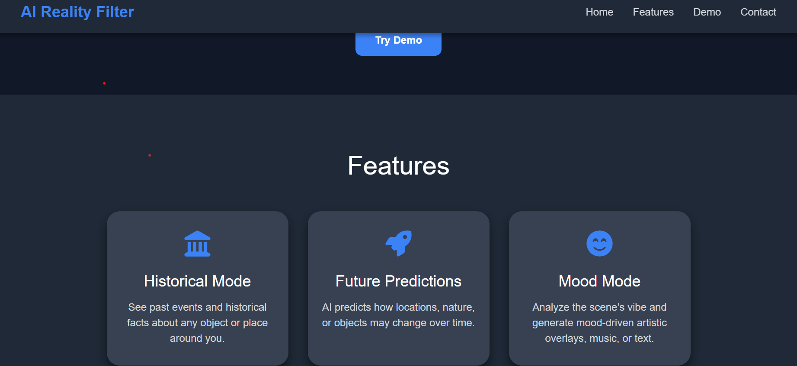

# Visionary-AI
The Project contain an AI-driven congnitive system which interprets real world scenes in realtime.
The Project is build in django and it is using Gemini api. 
<h2>Key Features</h2>

It has three Features
 
<h3>1.History:</h3> 
   It will the scene in internet and will provide you history of it.If it does not have real history it will generate fake history. 
<h3>2.Future:</h3> 
  It will predict the future based on history of scene.if it does not have real history then it will predict future by its own. 

<h3>3.Present:</h3>
  It will explain the current scene with complete details.

<h2>Tech Stack</h2>
<h3>Backend</h3>
<ul>
<li>Python</li>
<li>Django</li>
</ul>

<h3>Frontend</h3>
<ul>
<li>HTML</li>
<li>CSS</li>
<li>JS</li>
</ul>

Installation
</h2>
<h3>Clone the repository</h3>

git clone https://github.com/fakhirmasood-dev/Visionary-AI 
cd Visionary-AI

<h3>Create a Vistual environment</h3>

python -m venv venv 
Activate it:

<h4>Windows</h4>

venv\scripts\activate

<h4>Linux/macOS</h4>

source venv/bin/activate

<h3>Install dependencies</h3>

pip install -r requirements.txt

<h3>Apply migrations</h3>

python manage.py migrate

<h3>Run the development server</h3>

python manage.py runserver 
Open this url in browser http://127.0.0.1:8000/FM-Mart/home

<h3>Environment Variables</h3>

create .env file and provide all environment variables.

<h1>Author</h1>
<h3>Fakhir Masood</h3>